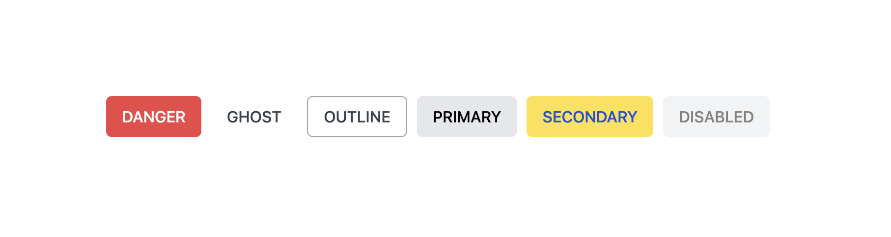

# BaseButton 컴포넌트

`BaseButton`은 크기(`SIZES`), 스타일(`VARIANTS`)을 지정해 다양한 버튼을 만들 수 있는 **기본 버튼 컴포넌트**입니다.



---

## Props

| 이름        | 타입      | 기본값             | 설명                                      |
| ----------- | --------- | ------------------ | ----------------------------------------- |
| `type`      | string    | `'button'`         | 버튼의 타입 (`button`, `submit`, `reset`) |
| `disabled`  | boolean   | `false`            | 버튼을 비활성화 상태로 설정               |
| `variant`   | string    | `VARIANTS.PRIMARY` | 버튼 스타일 종류                          |
| `size`      | string    | `SIZES.MEDIUM`     | 버튼 크기                                 |
| `className` | string    | `''`               | 추가 Tailwind 클래스                      |
| `label`     | string    | `''`               | 접근성을 위한 aria-label 값               |
| `children`  | ReactNode |                    | 버튼 내부 콘텐츠 (아이콘/텍스트)          |

---

## 스타일 옵션

### VARIANTS

- `PRIMARY` : bg-gray-200 text-black hover:bg-gray-300
- `SECONDARY` : bg-yellow-300 text-blue-700 hover:bg-yellow-400
- `DANGER` : bg-red-500 text-white hover:bg-red-600
- `OUTLINE` : border border-gray-400 text-gray-700 hover:bg-gray-100
- `GHOST` : bg-transparent text-gray-700 hover:bg-gray-200

### SIZES

- `SMALL` : px-2 py-1 text-sm rounded
- `MEDIUM` : px-4 py-2 text-base rounded-md
- `LARGE` : px-6 py-3 text-lg rounded-lg

---

## 사용 예시

```jsx
import BaseButton from './BaseButton'
import { VARIANTS, SIZES } from './const'

// 기본 버튼
<BaseButton>기본 버튼</BaseButton>

// 사이즈
<BaseButton size={SIZES.SMALL}>작은 버튼</BaseButton>
<BaseButton size={SIZES.LARGE}>큰 버튼</BaseButton>

// 스타일
<BaseButton variant={VARIANTS.PRIMARY}>기본 버튼</BaseButton>
<BaseButton variant={VARIANTS.DANGER}>삭제 버튼</BaseButton>

// 접근성 label
<BaseButton label="닫기 버튼">❌</BaseButton>

// 커스텀 className
<BaseButton className="w-full">꽉 찬 버튼</BaseButton>
```
