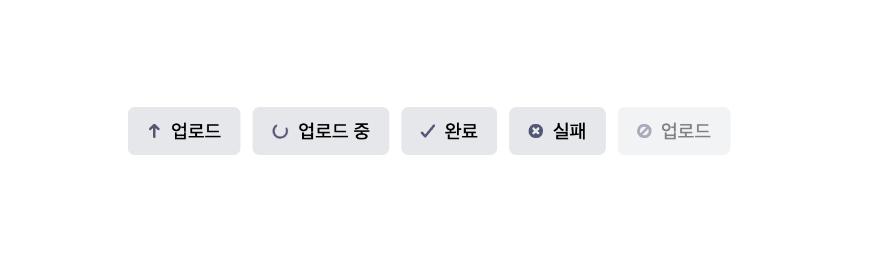

# UploadButton 컴포넌트

`UploadButton`은 업로드 과정을 표현하기 위한 버튼 컴포넌트입니다.  
업로드 상태(`UPLOAD_STATUS`)에 따라 **아이콘과 라벨이 자동으로 변경**되며, 로딩 시에는 `SpinnerIcon` 애니메이션이 표시됩니다.

## 

## Props

| 이름       | 타입    | 기본값               | 설명                                                    |
| ---------- | ------- | -------------------- | ------------------------------------------------------- |
| `status`   | string  | `UPLOAD_STATUS.IDLE` | 업로드 상태 (`idle`, `loading`, `resolved`, `rejected`) |
| `disabled` | boolean | `false`              | 버튼 비활성화 여부                                      |
| `loading`  | boolean | `false`              | 로딩 애니메이션 강제 표시 여부                          |

---

### UPLOAD_STATUS

- `IDLE` : 업로드
- `LOADING` : 업로드 중
- `RESOLVED` : 업로드 완료
- `REJECTED` : 업로드 실패
- 비활성화(disabled=true) 시에는 항상 (`NOT_ALLOWED`) 아이콘 표시.

---

## ✨ 사용 예시

```jsx
import UploadButton, { UPLOAD_STATUS } from './UploadButton'

// 기본 상태 (대기)
<UploadButton status={UPLOAD_STATUS.IDLE} />

// 업로드 중
<UploadButton status={UPLOAD_STATUS.LOADING} loading />

// 업로드 성공
<UploadButton status={UPLOAD_STATUS.RESOLVED} />

// 업로드 실패
<UploadButton status={UPLOAD_STATUS.REJECTED} />

// 비활성화 버튼
<UploadButton disabled />
```
