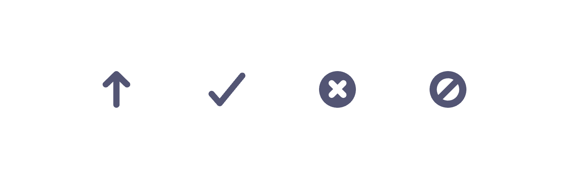

# SvgIcon 컴포넌트

`SvgIcon`은 프로젝트에서 사용하는 **정적(Static) SVG 아이콘**을 렌더링하는 컴포넌트입니다.  
`type`에 따라 다양한 아이콘을 불러올 수 있으며, 크기(`size`, `pathSize`)와 색상(`color`)을 자유롭게 지정할 수 있습니다.

---

## 

## Props

| 이름       | 타입   | 기본값              | 설명                                      |
| ---------- | ------ | ------------------- | ----------------------------------------- |
| `type`     | string | `SVG_TYPE.UP_ARROW` | 아이콘 종류                               |
| `size`     | number | `12`                | SVG 태그의 width/height                   |
| `pathSize` | number | `12`                | `viewBox` 크기 지정                       |
| `color`    | string | `'#525577'`         | 아이콘 색상 (fill)                        |
| `label`    | string | `''`                | 접근성 라벨 (없으면 `aria-hidden="true"`) |

---

## 아이콘 타입

### SVG_TYPE

- `UP_ARROW` : 업로드/위 화살표 아이콘
- `CHECK_MARK` : 체크 아이콘
- `CROSS` : 닫기/실패 아이콘
- `NOT_ALLOWED` : 금지 아이콘

---

## 사용 예시

```jsx
import SvgIcon from './SvgIcon'
import { SVG_TYPE } from './const'

// 기본 아이콘
<SvgIcon type={SVG_TYPE.UP_ARROW} />

// 색상 변경
<SvgIcon type={SVG_TYPE.CHECK_MARK} color="green" />

// 크기 변경
<SvgIcon type={SVG_TYPE.CROSS} size={24} pathSize={24} />

// 접근성 라벨
<SvgIcon type={SVG_TYPE.NOT_ALLOWED} label="금지 아이콘" />
```
